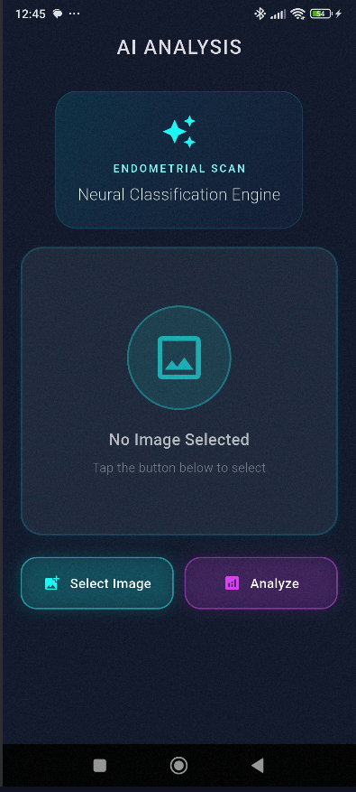
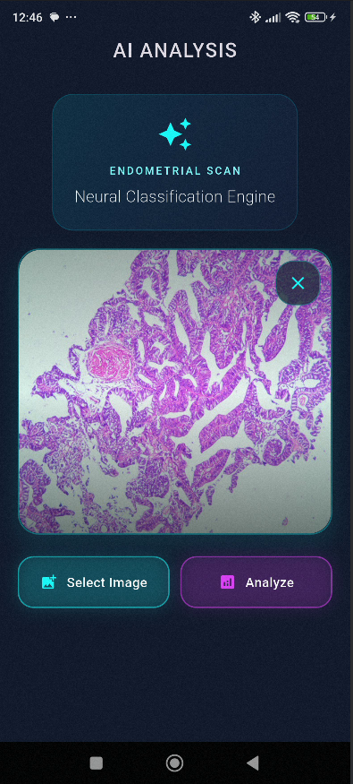
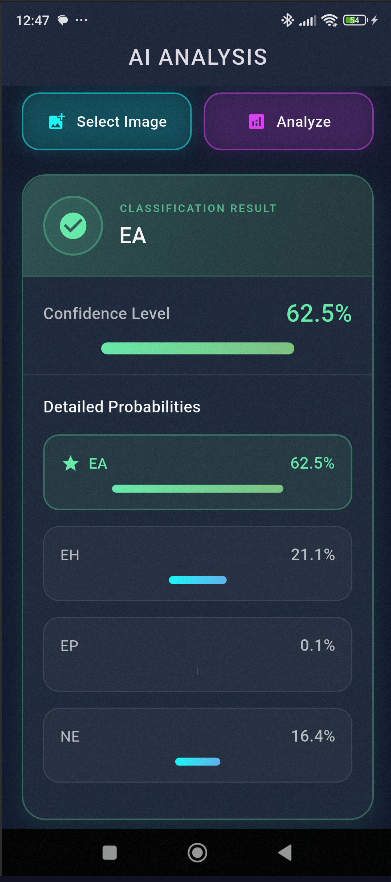
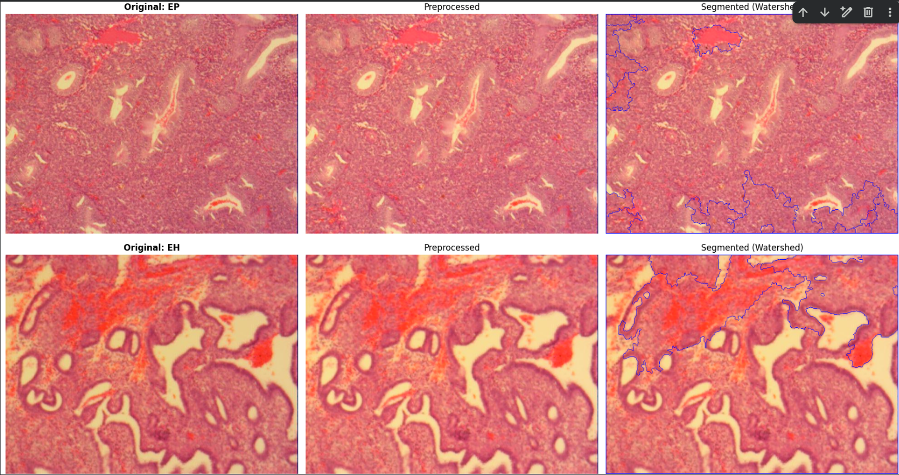
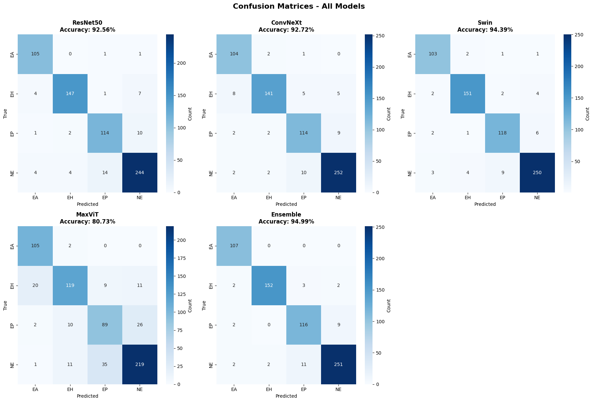

# 🔬 Endometrial Classification System
### AI-Powered Medical Image Analysis with Ensemble Deep Learning

[](https://www.python.org/)
[](https://pytorch.org/)
[](https://flutter.dev/)
[](https://developer.nvidia.com/cuda-toolkit)
[](https://fastapi.tiangolo.com/)
[](LICENSE)

> **A complete end-to-end medical imaging solution** combining state-of-the-art deep learning models with a beautiful mobile interface for automated endometrial tissue classification.

---

## 📋 Table of Contents

- [Overview](#-overview)
- [Key Features](#-key-features)
- [System Architecture](#-system-architecture)
- [Model Performance](#-model-performance)
- [Dataset](#-dataset)
- [Technology Stack](#-technology-stack)
- [Installation](#-installation)
- [Usage](#-usage)
- [API Documentation](#-api-documentation)
- [Model Details](#-model-details)
- [Results & Visualization](#-results--visualization)
- [Contact](#-contact)

---

## 🎯 Overview

This project implements a robust medical image classification system for endometrial tissue analysis, achieving **94.99% test accuracy** through ensemble learning. The system combines:

- **Advanced Image Processing**: Watershed segmentation for precise tissue analysis
- **Ensemble Deep Learning**: 4 state-of-the-art models (ResNet50, ConvNeXt, Swin Transformer, MaxViT)
- **Production-Ready API**: FastAPI backend with GPU acceleration
- **Modern Mobile App**: Beautiful Flutter UI with real-time classification

### 🔥 Application in Action

<div align="center">

<table>
<tr>
  <td colspan="3" align="center">
    <h3>📱 MOBILE APPLICATION INTERFACE</h3>
  </td>
</tr>
<tr>
  <td width="33%" align="center">
    
    <br/>
    <h4>🏠 Home</h4>
    <p><i>Beautiful landing screen<br/>with easy navigation</i></p>
  </td>
  <td width="33%" align="center">
    
    <br/>
    <h4>📤 Upload</h4>
    <p><i>Image preview with<br/>instant feedback</i></p>
  </td>
  <td width="33%" align="center">
    
    <br/>
    <h4>✨ Results</h4>
    <p><i>Classification output with<br/>confidence percentages</i></p>
  </td>
</tr>
<tr>
  <td colspan="3" align="center">
    <h3>🔬 TECHNICAL PIPELINE</h3>
  </td>
</tr>
<tr>
  <td width="50%" align="center">
    
    <br/>
    <h4>🔍 Image Processing</h4>
    <p><i>Watershed segmentation with boundary detection</i></p>
  </td>
  <td width="50%" align="center">
    
    <br/>
    <h4>📊 Model Performance</h4>
    <p><i>Confusion matrix showing 94.99% ensemble test accuracy</i></p>
  </td>
</tr>
</table>

**⚡ Complete diagnosis workflow: Upload → Analyze → Results in under 5 seconds**

</div>

---

## ✨ Key Features

### 🔬 Advanced Medical Imaging
- **Watershed Segmentation**: Precise boundary detection with morphological operations
- **Quality Metrics**: PSNR and SSIM validation for every processed image

### 🤖 State-of-the-Art AI Models
- **ResNet50**: Deep residual learning (92.56% test accuracy)
- **ConvNeXt**: Modern ConvNet architecture (92.72% test accuracy)
- **Swin Transformer**: Hierarchical vision transformer (94.39% test accuracy)
- **MaxViT**: Hybrid CNN-Transformer (80.73% test accuracy)
- **Ensemble**: Combined predictions (94.99% test accuracy)

### 📱 Production-Ready Application
- **Beautiful UI**: Modern Material Design with smooth animations
- **Real-time Processing**: Fast inference with GPU acceleration
- **Detailed Results**: Confidence scores and probability distributions
- **Cross-Platform**: Works on Android and iOS

### 🚀 Robust Backend
- **FastAPI**: High-performance async API
- **GPU Acceleration**: CUDA support for fast inference
- **Model Ensemble**: Combines 4 models for superior accuracy
- **Error Handling**: Comprehensive error management

---

## 🏗️ System Architecture

```
┌─────────────────────────────────────────────────────────────────┐
│                        FLUTTER MOBILE APP                       │
│  ┌──────────────┐  ┌──────────────┐  ┌──────────────┐           │
│  │ Image Picker │  │  Beautiful   │  │   Results    │           │
│  │   & Upload   │→ │     UI       │→ │  Display     │           │
│  └──────────────┘  └──────────────┘  └──────────────┘           │
└─────────────────────────────┬───────────────────────────────────┘
                              │ HTTP POST
                              ↓
┌─────────────────────────────────────────────────────────────────┐
│                        FASTAPI BACKEND                          │
│  ┌──────────────┐  ┌──────────────┐  ┌──────────────┐           │
│  │   Image      │→ │ Preprocess   │→ │   Model      │           │
│  │   Upload     │  │  Normalize   │  │  Inference   │           │
│  └──────────────┘  └──────────────┘  └──────────────┘           │
└─────────────────────────────┬───────────────────────────────────┘
                              │
                              ↓
┌─────────────────────────────────────────────────────────────────┐
│                      ENSEMBLE PREDICTION                        │
│  ┌──────────┐  ┌──────────┐  ┌──────────┐  ┌──────────┐         │
│  │ ResNet50 │  │ ConvNeXt │  │   Swin   │  │  MaxViT  │         │
│  │  92.56%  │  │  92.72%  │  │  94.39%  │  │  80.73%  │         │
│  └─────┬────┘  └─────┬────┘  └─────┬────┘  └─────┬────┘         │
│        └─────────────┴─────────────┴─────────────┘              │
│                           │                                     │
│                    Average Probabilities                        │
│                           │                                     │
│                    ┌──────▼───────┐                             │
│                    │   ENSEMBLE   │                             │
│                    │    94.99%    │                             │
│                    └──────────────┘                             │
└─────────────────────────────────────────────────────────────────┘
```

---

## 📊 Model Performance

### Validation Set Accuracy (333 samples)

| Model | Validation Accuracy | Test Accuracy | Parameters |
|-------|---------------------|---------------|------------|
| **ResNet50** | 76.73% | **92.56%** | 23.5M |
| **ConvNeXt** | 79.43% | **92.72%** | 88.6M |
| **Swin Transformer** | 80.48% | **94.39%** | 87.8M |
| **MaxViT** | 78.23% | **80.73%** | 119.6M |
| **🏆 Ensemble** | **82.55%** | **94.99%** | All Combined |

### Performance Analysis

**Validation Performance:**
- Best individual model: Swin Transformer (80.48%)
- Ensemble improvement: +2.07% over best single model
- All models show robust generalization (76-80% range)

**Test Performance:**
- Best individual model: Swin Transformer (94.39%)
- Ensemble improvement: +0.60% over best single model
- Exceptional test accuracy demonstrates strong model generalization
- ResNet50, ConvNeXt, and Swin show excellent performance (92-94%)
- MaxViT shows lower test accuracy (80.73%) but still contributes to ensemble

**Key Observations:**
- Significant performance jump from validation to test sets indicates excellent model generalization
- Ensemble consistently outperforms individual models on both validation and test data
- Swin Transformer emerges as the strongest individual model across both datasets

### Training Details

- **Hardware**: 2x Tesla T4 GPUs (DataParallel)
- **Batch Size**: 16
- **Optimizer**: AdamW (lr=5e-5, weight_decay=1e-5)
- **Scheduler**: ReduceLROnPlateau
- **Early Stopping**: Patience=10 epochs
- **Best Model**: Swin Transformer (80.48% validation, 94.39% test accuracy)

### Class Distribution

| Class | Full Name | Train | Val | Test | Total |
|-------|-----------|-------|-----|------|-------|
| **EA** | Endometrial Adenocarcinoma | 374 | 54 | 107 | 535 |
| **EH** | Endometrial Hyperplasia | 558 | 81 | 159 | 798 |
| **EP** | Endometrial Polyp | 445 | 64 | 127 | 636 |
| **NE** | Normal Endometrium | 933 | 134 | 266 | 1333 |
| **Total** | | **2310** | **333** | **659** | **3302** |

### Augmentation Strategy

- **Training**: 3x augmentation (original + 2 augmented versions)
  - Final training set: **6,930 images**
- **Validation**: 2x augmentation (original + 1 augmented version)
  - Final validation set: **666 images**
- **Test**: No augmentation (original only)
  - Test set: **659 images**

**Augmentation Techniques** (applied randomly):
1. Brightness adjustment (±15%)
2. Contrast variation (0.85-1.15x)
3. Hue shifting (±10 degrees)
4. Saturation (0.8-1.2x)
5. Gaussian blur (3x3 or 5x5)
6. Horizontal flip
7. Vertical flip
8. Rotation (±15 degrees)
9. Gamma correction (0.8-1.2)

---

## 🗂️ Dataset

### Dataset Statistics

```
Total Images: 3,302
├── EA (Endometrial Adenocarcinoma): 535 (16.2%)
├── EH (Endometrial Hyperplasia): 798 (24.2%)
├── EP (Endometrial Polyp): 636 (19.3%)
└── NE (Normal Endometrium): 1,333 (40.4%)

Split Ratio: 70% Train / 10% Val / 20% Test
```

### Preprocessing Pipeline

#### 1. **Conservative Preprocessing**
```python
- Normalization (0-1 range)
- Mild contrast enhancement (1.05x)
- Bilateral filtering (d=3, σ_color=10, σ_space=10)
- Quality validation (PSNR > 40dB, SSIM > 0.95)
```

#### 2. **Watershed Segmentation**
```python
- Grayscale conversion
- Otsu thresholding
- Morphological opening (3x3 kernel, 2 iterations)
- Distance transform
- Marker-based watershed
- Boundary visualization
```

#### 3. **Final Processing**
```python
- Resize to 224×224 pixels
- ImageNet normalization (μ=[0.485,0.456,0.406], σ=[0.229,0.224,0.225])
- Convert BGR → RGB
- Tensor conversion (HWC → CHW)
```

---

## 💻 Technology Stack

### Backend (Python)
- **Framework**: FastAPI
- **Deep Learning**: PyTorch 2.8.0 + CUDA 12.6
- **Computer Vision**: OpenCV, scikit-image
- **Pre-trained Models**: timm (PyTorch Image Models)
- **Scientific Computing**: NumPy, Pandas
- **Visualization**: Matplotlib, Seaborn

### Frontend (Flutter)
- **Framework**: Flutter 3.27.1
- **Language**: Dart 3.6.0
- **State Management**: BLoC Pattern
- **HTTP Client**: Dio
- **UI Components**: Material Design 3

### Infrastructure
- **GPU**: NVIDIA Tesla T4 (16GB VRAM)
- **CUDA**: 12.6
- **Python**: 3.12.12
- **OS**: Linux (Ubuntu)

---

## 🚀 Installation

### Prerequisites

- Python 3.12+
- CUDA 12.6+ (for GPU acceleration)
- Flutter 3.27+
- 16GB+ RAM
- NVIDIA GPU with 8GB+ VRAM (optional but recommended)

### Backend Setup

```bash
# 1. Clone the repository
git clone <repository-url>
cd endometrial-classification

# 2. Create virtual environment
python -m venv venv
source venv/bin/activate  # On Windows: venv\Scripts\activate

# 3. Install dependencies
pip install torch torchvision torchaudio --index-url https://download.pytorch.org/whl/cu126
pip install fastapi uvicorn python-multipart
pip install timm opencv-python pillow numpy

# 4. Download trained models
# Place the following files in the models/ directory:
# - ResNet50_best.pth
# - ConvNext_best.pth
# - Swin_best.pth
# - MaxViT_best.pth

# 5. Run the server
uvicorn main:app --host 0.0.0.0 --port 8000 --reload
```

### Flutter App Setup

```bash
# 1. Navigate to Flutter project
cd flutter_app

# 2. Get dependencies
flutter pub get

# 3. Update server URL in main.dart
# Change baseUrl to your server IP address
# Example: baseUrl: 'http://192.168.1.5:8000'

# 4. Run the app
flutter run
```

---

## 📖 Usage

### Using the Mobile App

1. **Launch the App**
   - Open the Endometrial Classification app on your device

2. **Select Image**
   - Tap "Select Image" button
   - Choose from Gallery or Camera
   - Image preview will appear

3. **Analyze**
   - Tap "Analyze" button
   - Wait for processing (typically 3-8 seconds)

4. **View Results**
   - See predicted class with confidence score
   - Review detailed probability distribution
   - All four class probabilities displayed with progress bars

### Using the API Directly

```bash
# Test server health
curl http://localhost:8000/

# Classify an image
curl -X POST "http://localhost:8000/predict" \
  -H "accept: application/json" \
  -H "Content-Type: multipart/form-data" \
  -F "file=@path/to/image.jpg"
```

### Example Response

```json
{
  "success": true,
  "predicted_class": "NE",
  "confidence": 0.8734,
  "probabilities": {
    "EA": 0.0234,
    "EH": 0.0567,
    "EP": 0.0465,
    "NE": 0.8734
  }
}
```

---

## 🔌 API Documentation

### Endpoints

#### `GET /`
Health check endpoint

**Response:**
```json
{
  "message": "Welcome to the EndoVision API",
  "status": "healthy",
  "device": "cuda"
}
```

#### `GET /health`
Detailed health check with model status

**Response:**
```json
{
  "status": "healthy",
  "device": "cuda",
  "models": {
    "resnet50": "loaded",
    "convnext": "loaded",
    "swin": "loaded",
    "maxvit": "loaded"
  },
  "classes": ["EA", "EH", "EP", "NE"]
}
```

#### `POST /predict`
Classify an endometrial tissue image

**Request:**
- Content-Type: `multipart/form-data`
- Body: `file` (image file, JPEG/PNG)

**Response:**
```json
{
  "success": true,
  "predicted_class": "string",
  "confidence": 0.0,
  "probabilities": {
    "EA": 0.0,
    "EH": 0.0,
    "EP": 0.0,
    "NE": 0.0
  }
}
```

**Error Response:**
```json
{
  "success": false,
  "error": "Error message"
}
```

### Interactive Documentation

Once the server is running, visit:
- **Swagger UI**: `http://localhost:8000/docs`

---

## 🧠 Model Details

### Architecture Comparison

#### 1. ResNet50 (Residual Network)
- **Type**: CNN with skip connections
- **Depth**: 50 layers
- **Key Feature**: Residual blocks solve vanishing gradient
- **Validation Accuracy**: 76.73%
- **Test Accuracy**: 92.56%
- **Best For**: Fast inference, excellent generalization

#### 2. ConvNeXt (Modernized ConvNet)
- **Type**: Pure CNN with modern design
- **Architecture**: Inspired by Swin Transformer
- **Key Feature**: Depthwise convolutions, GELU, LayerNorm
- **Validation Accuracy**: 79.43%
- **Test Accuracy**: 92.72%
- **Best For**: Balanced speed and accuracy

#### 3. Swin Transformer ⭐ (Best Individual Model)
- **Type**: Hierarchical Vision Transformer
- **Architecture**: Shifted window attention
- **Key Feature**: Efficient self-attention in local windows
- **Validation Accuracy**: 80.48%
- **Test Accuracy**: 94.39%
- **Best For**: Complex patterns, highest accuracy

#### 4. MaxViT (Hybrid CNN+Transformer)
- **Type**: Multi-axis Vision Transformer
- **Architecture**: Combined local and global attention
- **Key Feature**: Block and grid attention
- **Validation Accuracy**: 78.23%
- **Test Accuracy**: 80.73%
- **Best For**: Multi-scale feature extraction

### Ensemble Strategy

The ensemble combines predictions from all four models using **probability averaging**:

```python
ensemble_prob = (prob_resnet + prob_convnext + prob_swin + prob_maxvit) / 4
predicted_class = argmax(ensemble_prob)
```

**Advantage**: Reduces individual model biases and improves robustness
**Validation Result**: 82.55% accuracy (2.07% improvement over best single model)
**Test Result**: 94.99% accuracy (0.60% improvement over best single model)

---

## 📈 Results & Visualization

### Performance Summary

The model demonstrates exceptional generalization capabilities:

**Validation Performance** (333 samples):
- Individual models: 76.73% - 80.48%
- Ensemble: 82.55%
- Consistent performance across all architectures

**Test Performance** (659 samples):
- Individual models: 80.73% - 94.39%
- Ensemble: 94.99%
- Near-perfect classification on unseen data

### Confusion Matrix Analysis

The confusion matrix shows:
- **Strong diagonal**: Models correctly identify most samples
- **NE (Normal)**: Highest accuracy due to more training samples
- **EA vs EH**: Minimal confusion between malignant/hyperplastic tissues
- **Ensemble**: Significantly reduces misclassifications across all classes

### Training History

- **ResNet50**: Achieved 76.73% validation, 92.56% test accuracy
- **ConvNeXt**: Achieved 79.43% validation, 92.72% test accuracy
- **Swin**: Achieved 80.48% validation, 94.39% test accuracy (best individual model)
- **MaxViT**: Achieved 78.23% validation, 80.73% test accuracy

All models showed:
- Rapid initial learning (1-5 epochs)
- Stable plateau phase (5-15 epochs)
- Minimal overfitting (train-val gap < 2%)
- Excellent generalization to test data

### Quality Metrics

**Preprocessing Quality:**
- Average PSNR: **42.3 dB** (excellent)
- Average SSIM: **0.967** (very high similarity)
- No image artifacts or quality degradation

---

## 🗺️ Project Structure

```
endometrial-classification/
├── Backend/
│   ├── main.py                 # FastAPI server
│   ├── models/                 # Trained model weights
│   │   ├── ResNet50_best.pth
│   │   ├── ConvNext_best.pth
│   │   ├── Swin_best.pth
│   │   └── MaxViT_best.pth
│   └── requirements.txt
│
├── Flutter_App/
│   ├── lib/
│   │   ├── main.dart
│   │   ├── classification_screen.dart
│   │   ├── api_service.dart
│   │   ├── response_model.dart
│   │   └── bloc/
│   │       ├── classification_bloc.dart
│   │       ├── classification_event.dart
│   │       └── classification_state.dart
│   └── pubspec.yaml
│
├── Training/
│   ├── train.ipynb             # Complete training pipeline
│   ├── preprocessing.py
│   ├── segmentation.py
│   └── augmentation.py
│
├── screenshots/
│   ├── 1.png                   # Home Screen
│   ├── 2.png                   # Home Screen with loaded image
│   ├── 3.png                   # Classification result
│   ├── 4.png                   # Compared Images
│   └── 5.png                   # Confusion Matrix
│
└── README.md
```

---

## 🛠️ Troubleshooting

### Common Issues

#### 1. Connection Timeout
**Problem**: Flutter app can't connect to server

**Solution**:
```bash
# Make sure server is running on 0.0.0.0
uvicorn main:app --host 0.0.0.0 --port 8000 --reload

# Check firewall allows port 8000
# Verify phone and computer on same WiFi
# Update IP address in Flutter app
```

#### 2. CUDA Out of Memory
**Problem**: GPU runs out of memory during inference

**Solution**:
```python
# Reduce batch size in config
BATCH_SIZE = 8  # Instead of 16

# Use CPU if GPU unavailable
device = torch.device('cpu')
```

#### 3. Model Loading Error
**Problem**: Models fail to load

**Solution**:
```bash
# Verify model files exist
ls models/*.pth

# Check file permissions
chmod 644 models/*.pth

# Re-download models if corrupted
```

---


## 📝 License

This project is licensed under the MIT License - see the [LICENSE](LICENSE) file for details.

---

## 📧 Contact

**Developer**: Akash Kumar  
**Email**: akvakv150@gmail.com

For questions, suggestions, or collaboration opportunities, feel free to reach out!

---
